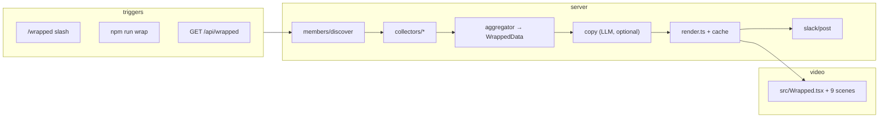

# Wrapped — project overview

**Wrapped** is a Slack-first (plus optional web UI) product that turns a teammate’s recent work activity into a **~25-second, 1080×1920 vertical reel** in the style of Wrapped. Someone runs `/wrapped @alice last-week`; the bot collects signals, renders an MP4 with Remotion, and posts it back to Slack.

**Zero friction for end users:** they don’t connect accounts. An admin configures **workspace-level** tokens (Slack bot, GitHub PAT, optional X / Linear / Notion / LLM). Per-user OAuth exists only for optional enrichments (LinkedIn, Gmail).

---

## Architecture

Two main halves:

| Layer            | Role                                                                                                                 |
| ---------------- | -------------------------------------------------------------------------------------------------------------------- |
| **`src/`**       | Remotion composition: 9 scenes, themes, CC0 music (deterministic per handle), `WrappedData` type + `DUMMY` fallbacks |
| **`server/`**    | Hono API, collectors, aggregation, render pipeline, Slack verify/post, members store                                 |
| **`web/`**       | Vite + React admin UI (generate, archive, members, schedule, channels)                                               |
| **`data/`**      | File-backed JSON: members, archive, schedule, encrypted OAuth tokens                                                 |
| **`out/cache/`** | MP4s keyed by hash of `WrappedData`                                                                                  |

---

## End-to-end flow (Slack)

1. `POST /api/slack/command` — verify HMAC signature (5-minute replay window).
2. `resolveOrDiscover(@user)` — load from `data/members.json` or call Slack `users.info` and persist.
3. **Ack within 3 seconds** with “Cooking…” (required by Slack).
4. Background worker: `collectAll` → `generateCopy` → `buildWrappedData` → `renderWrapped` → `postVideoToChannel`.

The same pipeline is exposed as `GET /api/wrapped?member=…&window=…&render=true` and `npm run wrap -- mayank last-week --render`.

---

## Video composition

`src/Wrapped.tsx` sequences **9 scenes** (~750 frames @ 30fps ≈ 25s):

Intro → Numbers → Peak hour → Emoji → Thread → Commit → Ghost mode → Vibe → Wrap.

- Music is `pickTrack(handle)` — **deterministic**, not random.
- Duration comes from the `SCENES` array only; do not hardcode duration elsewhere.

`WrappedData` (`src/data.ts`) is the single contract between backend and reel: messages/commits/lines, peak hour, top emoji, longest thread, hero commit, ghost-mode streaks, plus LLM/heuristic copy (`weekTitle`, `vibe`).

Collectors that return `null` (missing creds) cause the aggregator to fall back to **`DUMMY`** values so a reel still renders.

---

## Data sources

| Collector        | Needs             | Status in code                      |
| ---------------- | ----------------- | ----------------------------------- |
| Slack            | `SLACK_BOT_TOKEN` | Implemented                         |
| GitHub           | `GITHUB_TOKEN`    | Implemented                         |
| X                | `X_BEARER_TOKEN`  | Implemented                         |
| Linear / Notion  | API keys          | Implemented in `server/collectors/` |
| LinkedIn / Email | Per-user OAuth    | Stubs + `server/oauth/`             |
| Group wrap       | Channel ID        | `server/channels/`                  |

---

## File-backed persistence (`data/`) — there is no database

Wrapped intentionally uses flat JSON on disk plus the filesystem for video output. No SQLite, no Postgres. Scale is small (~20 people, < 10 MB after a year), data is portable, deployment is just "mount a volume." See [ARCHITECTURE.md → No database](./ARCHITECTURE.md#no-database) for the migration plan when this stops scaling.

| File / path              | Purpose                                                                                                  |
| ------------------------ | -------------------------------------------------------------------------------------------------------- |
| `data/members.json`      | Member registry (Slack id, GitHub handle, optional socials). Written only via `server/members/store.ts`. |
| `data/archive.json`      | Record of every rendered wrap — UI, Slack, or scheduler. Newest first.                                   |
| `data/schedule.json`     | Cron config for weekly wraps.                                                                            |
| `data/tokens.json`       | Per-member OAuth tokens (encrypted, used by v2 LinkedIn/Gmail flows).                                    |
| `out/cache/<sha>.mp4`    | Rendered video files, named by content hash for free dedupe.                                             |
| `wrapped_session` cookie | HS256-signed session JWT. **Stateless** — no server-side store.                                          |

**Both `data/` and `out/` must be mounted as persistent volumes** in any deployment. `data/` is metadata; `out/` is the actual videos. `out/cache/` can be ephemeral if you accept re-renders on demand.

---

## Centralized archive (by design)

`GET /api/archive` applies **no visibility filter** — every signed-in `@agrim.ai` user sees every wrap ever generated. This is the explicit Spotify-Wrapped framing (reels are shared social objects, not private documents). If you ever need to switch to per-user privacy, the single change is in `listEntries` in `server/archive/store.ts`: filter by `triggeredBy === session.email`.

The UI never auto-posts to Slack; the Slack slash command always does (to the channel where it was triggered). See the table in [README → Design intent](../README.md#design-intent-centralized-org-wide-archive).

---

## Conventions

- **ESM only** (`"type": "module"`), strict TypeScript, no `any`.
- Collectors **must** return `null` without creds.
- **Only** `server/members/store.ts` writes `members.json`.
- Install with `npm install --legacy-peer-deps` (peer dep conflicts with Remotion / Anthropic).
- Run `npm run check` before pushing (typecheck + lint + vitest).

---

## Where to work

| Task                   | Location                                                                          |
| ---------------------- | --------------------------------------------------------------------------------- |
| New slide              | `src/scenes/`, register in `Wrapped.tsx`; see `.claude/skills/design-reel-scene/` |
| New signal             | `server/collectors/foo.ts` → `types.ts` → `aggregator.ts` → maybe `WrappedData`   |
| Slack behavior         | `server/index.ts`, `server/slack/`                                                |
| Finish product surface | Wire archive, scheduler, oauth, channels, static web into `server/index.ts`       |
| Local test render      | `npm run wrap -- <member> last-week --render`                                     |

---

## Related documentation

- [SETUP.md](./SETUP.md) — clone, install, credentials, local dev
- [ARCHITECTURE.md](./ARCHITECTURE.md) — design decisions and extension points
- [DEPLOY.md](./DEPLOY.md) — Railway deployment
- [railway.md](./railway.md) — Railway CLI and Girijesh-agrim workspace setup
- [CONTRIBUTING.md](./CONTRIBUTING.md) — code style and patterns
- [wrapped.md](./wrapped.md) — original product spec (v1 / v2)
- [CLAUDE.md](../CLAUDE.md) — guidance for AI assistants (repo root)
